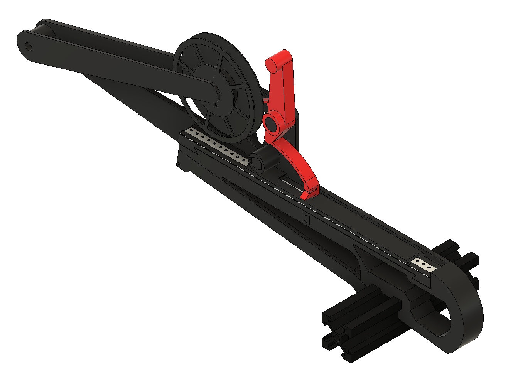
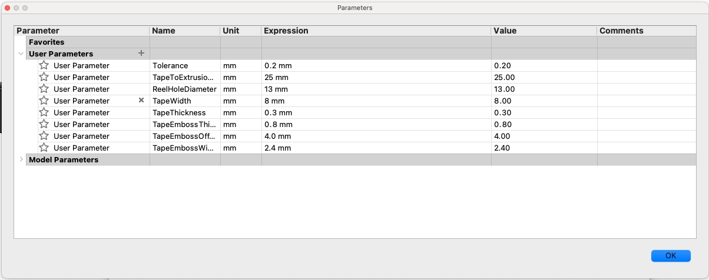

# LumenPPF

  
  <h3 align="center">LumenPnP optimized 3d-Printed Tape&Reel Feeder</h3>
  

    
  

 

## About

This project is an advancement of [markmaker's PushPullFeeder](https://github.com/markmaker/PushPullFeeder). Instead of OpenSCAD, this project uses a parametric approach in Autodesk Fusion 360. The main goal is to create a fully 3d-printed feeder for the [LumenPnP](https://github.com/index-machines/index), which fulfills the goals stated below.

## Goals

* Fully 3d-printed

* Printable on smaller printers (e.g. Prusa Mini)

* Tape insert should be parameterized

* LumenPnP can be operated on the ground (component reel must not be the lowest point of the PnP machine)

* Optimized in terms of filament usage

## Getting Started

Make sure you have installed [Fusion 360](https://www.autodesk.com/products/fusion-360/overview) and know the basics on how to use it.

1. Open the `LumenPPF.f3z` file inside of Fusion 360.
   
   * Note: the usage of the `.step` file in the `STEP` folder is not recommended

2. Open the `Change Parameters` option and adapt the feeder to your needs.

3. Export the tape insert and the lever since the other parts usually stay the same (8mm version)

4. Print all parts from the `STL` folder and the exported tape insert + lever

5. Assemble the feeder

6. Enjoy 🎉

 

## TODO

* Create a pull handle for the LumenPnP X-gantry

* Adapt the project for other tape sizes than 8mm

* Improve the mounting handle

* Test the design

## Limitations

This project is provided as-is!
Please feel free to adapt it to your needs and contribute to the project. I would be very grateful to include your improvements. Thanks for your support!

**WARNING:** Everyone is responsible for what he/she is doing! I am not responsible if you hurt yourself, torch your house or anything that kind trying to build/improve your coffee grinder! You are doing everything at your own risk!
